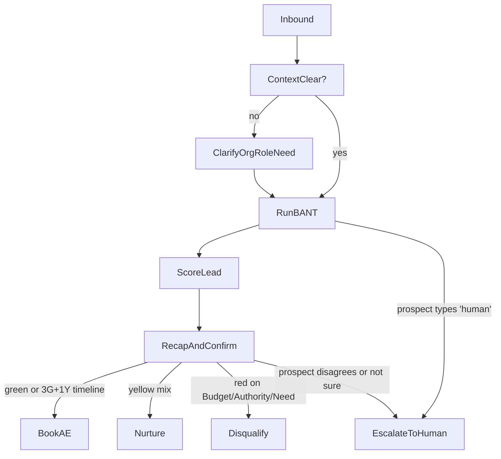
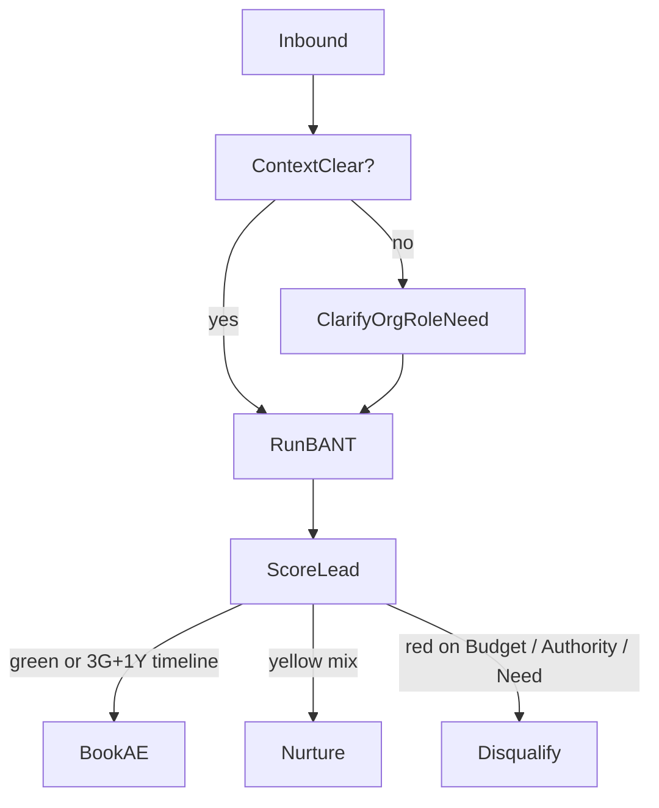

# The Gatekeeper – BANT Qualification Agent

## Overview

The Gatekeeper is a portfolio project that simulates a production-minded inbound lead qualification system for B2B sales teams.

Instead of treating qualification like a perfect form, it assumes real prospects give incomplete, vague, or messy answers. The agent collects BANT signals, scores the lead, explains its reasoning, confirms the interpretation with the prospect, and stores the result for review in a dashboard.

### What this project demonstrates

- **Business logic design** around Budget, Authority, Need, and Timeline (BANT)
- **Human-in-the-loop routing** instead of over-automating risky decisions
- **Explainable AI behavior** with recap, reason codes, and confidence bands
- **Hybrid decisioning** where transparent rules stay primary and Gemini helps with ambiguous language
- **Product thinking** through a CLI flow, persistent storage, a web dashboard, and simulation testing

The project started as a sales-qualification exercise and is presented here as a standalone portfolio project with genericized branding.

---

## Quick start

- **Requirements:** Python 3.9+ (tested on 3.11)

- **(Recommended) create a virtual environment:**

```bash
python3 -m venv .venv
source .venv/bin/activate  # macOS / Linux
# .venv\Scripts\activate   # Windows PowerShell / CMD
```

- **Install deps:**

```bash
pip install -r requirements.txt
```

- **Optional: add a `.env` file for Gemini support**

```bash
GOOGLE_API_KEY=your_key_here
```

`run.py`, `dashboard.py`, and `simulate_1000_leads.py` load `.env` automatically via `python-dotenv`, so there is no separate `export GOOGLE_API_KEY=...` step.

- **Run the CLI agent:**

```bash
python run.py
```

You answer as the prospect. Type `human` to simulate escalation to a person, or `quit` / `exit` to stop.

- **Run tests:**

```bash
python -m unittest discover -s tests -p 'test_*.py'
```

- **Run the Streamlit dashboard:**

```bash
streamlit run dashboard.py
```

- **Run the simulation harness:**

```bash
python simulate_1000_leads.py
```

---

## What it does

- **Runs a BANT qualification flow**
  - Need -> Authority -> Budget -> Timeline
  - Designed for natural language, not rigid form inputs

- **Uses transparent scoring rules first**
  - Keyword heuristics per BANT dimension
  - Numeric parsing for budget answers
  - Word-boundary checks so `“not sure”` is not misread as `“no”`
  - Conservative defaults that avoid overconfident automation

- **Adds lightweight clarification**
  - For vague inputs like `“just exploring”` or `“not sure”`, the CLI asks a focused follow-up instead of pretending it understood enough

- **Supports hybrid LLM-assisted classification**
  - If Gemini is available, the engine can interpret messier phrasing when the rule engine is uncertain
  - The LLM does not replace the workflow; it only helps translate messy text into structured BANT signals

- **Produces explainable outcomes**
  - Recaps each dimension as green / yellow / red with the original answer
  - Explains whether the lead is **book_ae**, **nurture**, or **disqualify**
  - Asks *“Does that sound right?”* before finalizing the result

- **Keeps a human in the loop**
  - If the prospect asks for a human, disagrees with the recap, or gives a non-confirming response, the lead is routed to **escalate_for_review**

- **Persists leads for review**
  - Stores answers, scores, lead score, confidence band, outcome, and reason code in SQLite
  - Makes those records visible in a Streamlit dashboard

- **Includes a simulation harness**
  - Generates synthetic leads and runs them through the engine to stress-test classification behavior at scale

---

## Lead qualification flow (what happens in the CLI)

This diagram includes the conversation steps, recap, and human escalation.



---

## Implementation (summary)

- **Flow**  
  BANT order: Need -> Authority -> Budget -> Timeline. The CLI keeps the interaction conversational, allows a small amount of clarification, then moves into recap and confirmation before final routing.

- **Scoring**  
  Per dimension: green/yellow/red via phrase lists in `gatekeeper/criteria.py`. Red is checked first, then green, then yellow; otherwise default yellow. Short tokens such as `"no"` use regex word boundaries so `"not sure"` is not treated as red. Budget answers are checked for numbers first; below a threshold of `500` scores red, above that scores green, otherwise keyword rules apply. `gatekeeper.engine.compute_lead_score` converts the four BANT signals into a weighted `0-100` score plus a coarse confidence band (`low`, `medium`, `high`).

- **Outcomes**  
  **book_ae:** 3+ green with Budget, Authority, and Need all green, and Timeline green or a single yellow. **nurture:** No red on Budget/Authority/Need, but not enough positive signal to book. **disqualify:** Any red on Budget, Authority, or Need.

- **Conversation layer**  
  After classification, `gatekeeper/messages.py` builds a recap with the prospect's raw phrasing plus the interpreted signal. `run.py` then asks `"Does that sound right?"`. Only an explicit yes confirms the automated result; anything else becomes **escalate_for_review**.

- **Hybrid LLM path**  
  `gatekeeper/engine.py` stays rules-first. If `GOOGLE_API_KEY` is present and at least two dimensions look uncertain, `gatekeeper/llm_classifier.py` calls Gemini `2.5-flash` through the `google-genai` SDK to classify Need, Authority, Budget, and Timeline as green/yellow/red. Those scores are fed back into the same engine, lead score, and routing logic.

- **Persistence and dashboard**  
  `gatekeeper/storage.py` writes lead records to SQLite. `dashboard.py` reads the same records and shows lead outcome, score, confidence, BANT breakdown, recap, and next-step explanation in a simple review UI.

- **Simulation**  
  `simulate_1000_leads.py` generates synthetic answer combinations to pressure-test routing outcomes and score distributions without manually running hundreds of conversations.

- **Environment handling**  
  `.env` loading is automatic through `python-dotenv`, so local CLI, dashboard, and simulation runs pick up `GOOGLE_API_KEY` without extra shell setup.

- **Tests**  
  `tests/test_engine.py`: strong-fit → book_ae, red budget → disqualify, "not sure" budget → nurture. Run: `python -m unittest discover -s tests -p 'test_*.py'`.

---

## Optional: LLM-based classification

By default, the Gatekeeper uses transparent keyword rules to score BANT responses. That keeps the system explainable and easy to inspect.

If a `GOOGLE_API_KEY` is available in `.env` or the environment, the engine can call Gemini `gemini-2.5-flash` through the `google-genai` SDK when the rule-based result is uncertain. In the current implementation, the LLM path is triggered when at least two dimensions are not confidently green. Gemini classifies each BANT answer into `green`, `yellow`, or `red`, and those labels are mapped back into the same scoring and routing pipeline.

This gives the project a practical hybrid architecture:

- **LLM as interpreter** for messy natural language
- **Rule engine as decider** for routing and explainability
- **Same downstream pipeline** for scoring, persistence, dashboard display, and escalation

---

## Sample conversation (CLI)

```text
Agent: What's driving you to look at something like this right now—retention, burnout, culture, or something else?
Prospect: retention
Agent: Are you the person who would sign off on a partnership like this, or would you be bringing in other decision-makers?
Prospect: I sign off
Agent: Do you have budget allocated for programs like this this year, or would this need to be approved?
Prospect: we have a line item approved
Agent: When would you ideally want to have something in place—this quarter, next quarter, or still exploring?
Prospect: this quarter

Agent: I'd love to get you on a call with our team. [Book AE]

Here's how I'm reading what you shared:
- Need: "retention" → green
- Authority: "I sign off" → green
- Budget: "we have a line item approved" → green
- Timeline: "this quarter" → green

Given that signal, I'm treating this as a strong fit and near-term timing.
Next step: I'll hand this off to our sales team and get time booked with an Account Executive.

Agent: Does that sound right? (yes/no)
```

---

## Core scoring logic (Pure BANT decision tree)

This diagram focuses only on the scoring decision (book / nurture / disqualify) from BANT answers.

The full decision logic is documented in more detail in
[`docs/02-logic-tree.md`]

At a high level, the classification looks like this:



---

## Project structure

- **`docs/`** – Design docs:
  - `01-qualification-framework.md` – BANT questions and green / yellow / red definitions
  - `02-logic-tree.md` – Flow and decision logic (written + visual)
  - `03-human-escalation-rules.md` – When to escalate, continue, or stop
  - `04-optimization-plan.md` – What to analyze and improve after 30 days
  - `05-qa-edge-cases.md` – Internal QA scenarios for stress-testing messy conversations
- **`gatekeeper/`** – Core logic:
  - `criteria.py` – Questions and scoring rules per BANT dimension
  - `engine.py` – Qualification engine, routing logic, and numeric lead score helper
  - `llm_classifier.py` – Gemini-based classifier for uncertain BANT answers
  - `messages.py` – Turns raw scores into human-readable recaps and next-step explanations
  - `storage.py` – SQLite-backed persistence for leads and their scores
- **`run.py`** – CLI harness that:
  - Walks through BANT questions
  - Applies clarifications for obviously vague inputs
  - Shows the recap + explanation and asks for confirmation
- **`dashboard.py`** – Streamlit app that lists leads, shows their BANT breakdown, and exposes recap + explanation in a web UI
- **`simulate_1000_leads.py`** – Script that generates synthetic leads and prints a summary of outcomes and score distributions
- **`tests/`** – Unit tests for core qualification logic

---

## Design notes

- **Assumes non-cooperative users**  
  Most qualification systems fail not because of poor questions, but because they assume cooperative users. Here, the logic expects partial answers, vague wording, and occasional contradictions.

- **Clarify before classify**  
  The agent prefers to ask one targeted follow-up (“When you say ‘exploring’, are you thinking this year or further out?”) instead of silently treating everything as green or red.

- **Humans stay in the loop where it matters**  
  When the prospect disagrees with the recap or doesn’t give a clear “yes,” the outcome becomes `escalate_for_review` instead of forcing an automated decision. This protects both the prospect experience and sales bandwidth.

For a deeper dive into the flows and trade-offs, see the files in `docs/`. For a more product-like view, run the CLI, inspect the stored leads in the Streamlit dashboard, and use the simulation script to stress-test how the system behaves across many synthetic prospects.

## Push your changes to github

cd "path/to/your/folder"
git init
git add .
git commit -m "Initial commit: Gatekeeper qualification agent"
git branch -M main
git remote add origin https://github.com/YOUR_USERNAME/YOUR_REPO_NAME.git
git push -u origin main